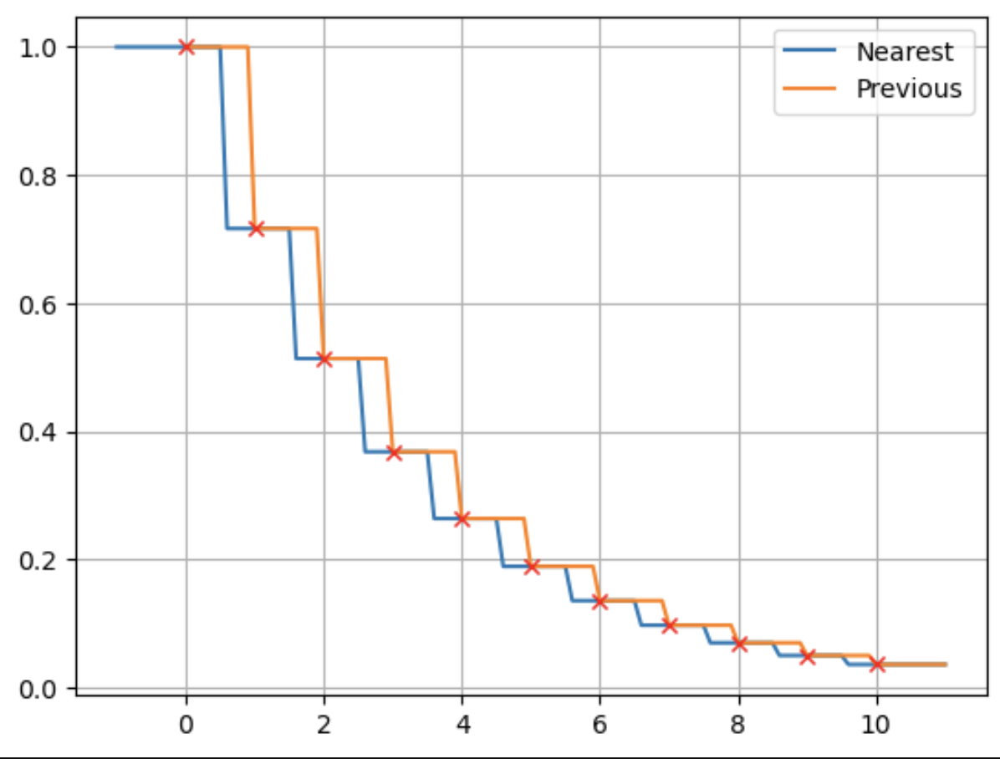

# Interp1d

[](https://AtsushiSakai.github.io/Interp1d.jl/stable)
[](https://AtsushiSakai.github.io/Interp1d.jl/dev)
[](https://github.com/AtsushiSakai/Interp1d.jl/actions)

A Julia package for univariate interpolations. 

This package is inspired by [scipy\.interpolate\.interp1d](https://docs.scipy.org/doc/scipy/reference/generated/scipy.interpolate.interp1d.html) function.

# Requirements

Julia 1.6.x or higher.

# Install

<!-- 
```jl
using Pkg;Pkg.add("Interp1d")
```

and then just import it with `using Interp1d`.
-->

If you want use latest development version, 

```jl
using Pkg;Pkg.add(url = "https://github.com/AtsushiSakai/Interp1d.jl.git")
```

# How to use

You can use many kind of univariate interpolations:
```jl
using Interp1d
using PyPlot
xi = collect(0.0:10.0) # x of interpolated points
yi = exp.(-xi./3.0) # y of interpolated points
x = collect(-1.0:0.1:11.0) # sampling points
for mode in INTERP_MODE_LIST # Do interpolations for all modes.
    f = interp(xi, yi, mode) # get an interpolation function
    y = f.(x) # Do interpolation
    plot(x, y, label=string(mode))
end
plot(xi, yi, "xr")
legend()
```
<p align="left"></p>

Details and other tips can be found in the latest documentaion:

- [Interp1d.jl Documentation](https://AtsushiSakai.github.io/Interp1d.jl/stable)


# Author

- [Atsushi Sakai](https://github.com/AtsushiSakai/) ([@Atsushi_twi](https://twitter.com/Atsushi_twi))

